# Skill: Fluxo de Trabalho, Versionamento e Entrega — PS

Esta skill estabelece o fluxo de trabalho obrigatório de ponta a ponta para qualquer tarefa, issue ou modificação no projeto **PS (Photo Storage)**.

---

## 🔄 Ciclo de Vida de uma Tarefa

```mermaid
flowchart LR
    A[1. Ler/Mapear Issue] --> B[2. Sincronizar Main Remota]
    B --> C[3. Criar Branch Dedicada]
    C --> D[4. Desenvolver & Validar]
    D --> E[5. Commit Semântico]
    E --> F[6. Re-sincronizar com Main]
    F --> G[7. Subir PR para Main]
    G --> H[8. Comentar e Fechar Issue]
```



---

## 📋 Protocolo de Execução Passo a Passo

### 1. Início da Tarefa & Sincronização Obrigatória da `main`
- Analise a issue utilizando o GitHub MCP (`get_issue`) ou o contexto da tarefa solicitada.
- > [!IMPORTANT]
  > **Garantia de `main` Atualizada**: É estritamente obrigatório sincronizar a branch `main` com a remota antes de criar qualquer nova branch de trabalho. Nunca crie uma branch a partir de uma `main` defasada.

Execute sempre a rotina de sincronização antes de iniciar:
```bash
# 1. Certifique-se de que a working tree está limpa
git status

# 2. Mude para a branch main e busque as últimas atualizações do repositório remoto
git checkout main
git fetch origin main
git pull origin main --ff-only

# 3. Crie e alterne para a branch dedicada a partir da main atualizada
git checkout -b <tipo>/<nome-da-branch>
```

#### Convenção de Nomes de Branch:
- **Com Issue vinculada**: `<tipo>/<id_da_issue>-<descricao-curta>`
  - `feat/27-async-clients-csv-report`: Novas funcionalidades vinculadas à issue #27.
  - `fix/30-report-phone-format-portuguese-payments`: Correções de bugs vinculadas à issue #30.
- **Sem Issue vinculada (manutenções internas/skills)**: `<tipo>/<descricao-curta>`
  - `chore/enforce-main-sync-workflow`: Ajustes de documentação interna e skills.
  - `docs/readme-update`: Atualizações de documentação.

---

### 2. Desenvolvimento & Validação Mandatória
- Execute as modificações necessárias seguindo as diretrizes da arquitetura (`ps-dev`) e segurança (`ps-security`).
- Se houver alteração em rotas ou handlers HTTP da API Go, execute obrigatoriamente:
  ```bash
  ./scripts/swagger.sh
  ```
- Execute a checagem completa e assegure 100% de aprovação antes de qualquer commit:
  ```bash
  ./scripts/check.sh all
  ```

---

### 3. Commits Semânticos (Conventional Commits)
- Organize os commits de forma atômica seguindo o padrão Conventional Commits:
  - **Com Issue**: `<tipo>(<escopo>): <descrição clara no imperativo> (#<id_da_issue>)`
    - `feat(reports): extração assíncrona de relatório csv com baixo consumo de memória (#27)`
    - `fix(reports): padronizar formatacao de telefone e traduzir formas de pagamento para portugues (#30)`
  - **Sem Issue**: `<tipo>(<escopo>): <descrição clara no imperativo>`
    - `chore(skills): align skills with domain models and real pull requests`

---

### 4. Re-sincronização com `main` e Envio do Pull Request (GitHub MCP)
- Antes de subir a branch ou abrir o PR, garanta que sua branch de trabalho incorpora as atualizações mais recentes da `main`:
  ```bash
  git fetch origin main
  git rebase origin/main
  ```
- Faça o push da branch para o repositório remoto (`git push -u origin <nome-da-branch>`).
- Abra o Pull Request apontando para a base `main` utilizando a ferramenta MCP do GitHub (`create_pull_request`):
  - **Title**: `<tipo>(<escopo>): <título semântico claro>` (com `(#<id_da_issue>)` se houver).
  - **Head**: `<nome-da-sua-branch>`
  - **Base**: `main`
  - **Body**: Deve conter:
    - Resumo detalhado das alterações realizadas.
    - Referência de fechamento se aplicável: `Closes #<id_da_issue>` ou `Resolves #<id_da_issue>`.
    - Checklist de validações executadas (`./scripts/check.sh all`, `./scripts/swagger.sh`).

---

### 5. Atualização e Fechamento da Issue (GitHub MCP)
- Se a tarefa estiver vinculada a uma issue:
  - Adicione um comentário na issue utilizando `add_issue_comment` informando a entrega com o link do PR criado.
  - Atualize o status da issue para fechada utilizando `update_issue(state: "closed")` quando o trabalho for entregue.

---

## 🛠️ Matriz de Ferramentas GitHub MCP Utilizadas

| Etapa | Ferramenta MCP GitHub | Finalidade |
| :--- | :--- | :--- |
| **Leitura da Issue** | `get_issue` | Obter descrição, contexto e requisitos da tarefa |
| **Criação do PR** | `create_pull_request` | Abrir PR direcionado à branch `main` |
| **Comentário na Issue**| `add_issue_comment` | Registrar entrega com link do PR |
| **Fechamento da Issue**| `update_issue` | Atualizar estado para `closed` |
