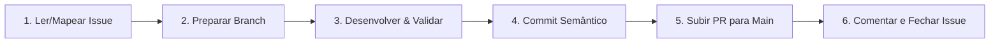

# Skill: Fluxo de Trabalho, Versionamento e Entrega — PS

Esta skill estabelece o fluxo de trabalho obrigatório de ponta a ponta para qualquer tarefa, issue ou modificação no projeto **PS (Photo Storage)**.

---

## 🔄 Ciclo de Vida de uma Tarefa



---

## 📋 Protocolo de Execução Passo a Passo

### 1. Início da Tarefa & Preparação da Branch
- Analise a issue utilizando o GitHub MCP (`get_issue`) ou o contexto da tarefa solicitada.
- Garanta que está trabalhando em uma branch dedicada a partir da `main` atualizada:
  - **Com Issue vinculada**: `<tipo>/<id_da_issue>-<descricao-curta>`
    - `feat/20-workflow-standardization`: Novas funcionalidades ou melhorias vinculadas à issue #20.
    - `fix/21-auth-session-timeout`: Correções de bugs vinculadas à issue #21.
    - `feat/22-fipe-cache-integration`: Features vinculadas à issue #22.
  - **Sem Issue vinculada (manutenções internas/skills)**: `<tipo>/<descricao-curta>`
    - `chore/skills-enhancement`: Ajustes de documentação interna e skills.
    - `docs/readme-update`: Atualizações de documentação.

### 2. Desenvolvimento & Validação Mandatória
- Execute as modificações necessárias seguindo as diretrizes da arquitetura (`ps-dev`) e segurança (`ps-security`).
- Se houver alteração em rotas ou handlers HTTP da API Go, execute obrigatoriamente:
  ```bash
  ./scripts/swagger.sh
  ```
- Execute a checagem completa e assegure 100% de aprovação antes de qualquer commit:
  ```bash
  ./scripts/check.sh all
  ```

### 3. Commits Semânticos (Conventional Commits)
- Organize os commits de forma atômica seguindo o padrão Conventional Commits:
  - **Com Issue**: `<tipo>(<escopo>): <descrição clara no imperativo> (#<id_da_issue>)`
    - `feat(workflows): unificar e padronizar pipelines de ci e deploy (#20)`
    - `fix(auth): implementar silent refresh e sessao de 24h (#21)`
    - `feat(cars): integrar fipe api com cache multinivel no mongodb (#22)`
  - **Sem Issue**: `<tipo>(<escopo>): <descrição clara no imperativo>`
    - `chore(skills): enhance ps-issues and ps-workflow guidelines`

### 4. Criação do Pull Request para `main` (GitHub MCP)
- Faça o push da branch para o repositório remoto.
- Abra o Pull Request apontando para a base `main` utilizando a ferramenta MCP do GitHub (`create_pull_request`):
  - **Title**: `<tipo>(<escopo>): <título semântico claro>` (com `(#<id_da_issue>)` se houver).
  - **Head**: `<nome-da-sua-branch>`
  - **Base**: `main`
  - **Body**: Deve conter:
    - Resumo detalhado das alterações realizadas.
    - Referência de fechamento se aplicável: `Closes #<id_da_issue>` ou `Resolves #<id_da_issue>`.
    - Checklist de validações executadas (`./scripts/check.sh all`, `./scripts/swagger.sh`).

### 5. Atualização e Fechamento da Issue (GitHub MCP)
- Se a tarefa estiver vinculada a uma issue:
  - Adicione um comentário na issue utilizando `add_issue_comment` informando a entrega com o link do PR criado.
  - Atualize o status da issue para fechada utilizando `update_issue(state: "closed")` quando o trabalho for entregue.

---

## 🛠️ Matriz de Ferramentas GitHub MCP Utilizadas

| Etapa | Ferramenta MCP GitHub | Finalidade |
| :--- | :--- | :--- |
| **Leitura da Issue** | `get_issue` | Obter descrição, contexto e requisitos da tarefa |
| **Criação do PR** | `create_pull_request` | Abrir PR direcionado à branch `main` |
| **Comentário na Issue**| `add_issue_comment` | Registrar entrega com link do PR |
| **Fechamento da Issue**| `update_issue` | Atualizar estado para `closed` |
