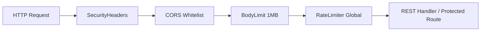

# 🔒 Autenticação e Segurança em Camadas — PS

A segurança no **PS (Photo Storage)** segue o princípio da defesa em profundidade (*defense-in-depth*), combinando isolamento de credenciais na camada de transporte HTTP, validação estrita de identidade em tempo de execução e proteção defensiva de rede.

Para navegação geral, retorne ao [Catálogo Canônico](../index.md).

---

## 🍪 1. Sessões Seguras via Cookies `HttpOnly`

O PS não armazena tokens de autenticação (JWT) no `localStorage` ou `sessionStorage` do navegador, eliminando o vetor principal de ataques XSS (conforme registrado no [ADR 0002](../adrs/0002-httponly-cookie-sessions.md)).

### Atributos dos Cookies de Sessão
| Cookie | Finalidade | TTL | Atributos de Segurança |
| :--- | :--- | :--- | :--- |
| `ps_access_token` | Assinatura de requisições autenticadas à API | 15 min | `HttpOnly; Secure; SameSite=Lax; Path=/; Domain=.ps.yurinogueira.dev.br` |
| `ps_refresh_token` | Rotação automática de sessão na rota `/auth/refresh` | 7 dias | `HttpOnly; Secure; SameSite=Lax; Path=/api/v1/auth; Domain=.ps.yurinogueira.dev.br` |

> [!IMPORTANT]
> **Proibição de Tokens no Payload JSON**: Endpoints de autenticação (`/auth/login`, `/auth/refresh`) gravam credenciais exclusivamente via cabeçalho `Set-Cookie`. O corpo JSON de resposta retorna apenas dados públicos do usuário (`id`, `name`, `email`, `role`, `tenantId`).

### Extração Defensiva de Identidade no Backend
Na extração de usuário (`extractUserID`), qualquer falha de validação ou token nulo resulta estritamente em `""` (vazio), forçando o status `401 Unauthorized`. Nunca é permitido fallback para valores padrão ou strings não validadas.

---

## 🛡️ 2. Middlewares de Segurança de Rede

Todas as requisições que chegam à API Go passam pela cadeia de middlewares defensivos configurada em `backend/internal/interfaces/rest/router.go`:

1. **Security Headers**: Injeção obrigatória dos cabeçalhos:
   - `X-Content-Type-Options: nosniff`
   - `X-Frame-Options: DENY`
   - `X-XSS-Protection: 1; mode=block`
   - `Referrer-Policy: strict-origin-when-cross-origin`
   - `Strict-Transport-Security: max-age=31536000; includeSubDomains` (em produção)
2. **CORS com Whitelist Estrita**: Proibição de wildcard `*` quando credenciais estão ativas. Apenas origens explicitamente listadas na variável `ALLOWED_ORIGINS` recebem `Access-Control-Allow-Origin`.
3. **Limite de Tamanho de Payload (`BodyLimit`)**: O middleware aplica `http.MaxBytesReader` limitando requisições em **1MB** contra ataques de negação de serviço (DoS) por sobrecarga de memória.
4. **Rate Limiting em Múltiplos Níveis**:
   - Limite global de API: 100 requisições/minuto por IP.
   - Limite em rotas sensíveis (`/auth/login`, `/auth/register`, `/auth/forgot-password`): 10 requisições/minuto por IP contra ataques de força bruta.

---

## 👥 3. Controle de Acesso Baseado em Papéis (RBAC)

O PS suporta quatro papéis hierárquicos implementados no domínio e validados no middleware de autenticação (`authctx`):

1. **`superadmin`**: Acesso irrestrito a todos os tenants e métricas globais do sistema.
2. **`admin`**: Administrador da conta do tenant; pode convidar fotógrafos, gerenciar clientes e visualizar faturamento.
3. **`photographer`**: Fotógrafo parceiro; realiza uploads e associa fotos a clientes e pessoas.
4. **`user`**: Cliente ou visualizador; consulta suas próprias fotografias e histórico de compras.

No frontend, a renderização condicional de menus e a proteção de rotas são orquestradas pelo componente `ProtectedRoute` ([Roteamento e RBAC](../frontend/routing-and-rbac.md)).

---

## 🔐 4. Mitigação contra OWASP Top 10

- **Injeção (NoSQL / SQL)**: Consultas ao MongoDB usam queries tipadas com `bson.M` e `bson.D` sem concatenação de strings.
- **Quebra de Autenticação**: Senhas utilizam `bcrypt` com custo padrão 10 e tamanho mínimo de 8 caracteres. Tokens de recuperação e e-mail utilizam hashes criptográficos aleatórios com expiração curta.
- **Exposição de Dados Sensíveis**: Toda comunicação externa é encapsulada em TLS 1.3 via Cloudflare e Caddy. Tokens e segredos não são expostos em logs da aplicação.
- **Controle de Acesso Quebrado**: Todas as entidades de banco de dados vinculam-se a `tenant_id`. Handlers REST conferem o `tenant_id` injetado pelo token JWT contra o recurso requisitado ([Multi-tenancy e Dados](multitenancy-and-data.md)).

---

## 🔗 Referências Cruzadas
- [Visão Geral da Arquitetura](overview.md)
- [Multi-tenancy e Isolamento de Dados](multitenancy-and-data.md)
- [Subdomínio de Autenticação](../domain/auth.md)
- [Roteamento e RBAC no Frontend](../frontend/routing-and-rbac.md)
- [ADR 0002: Cookies HttpOnly](../adrs/0002-httponly-cookie-sessions.md)
