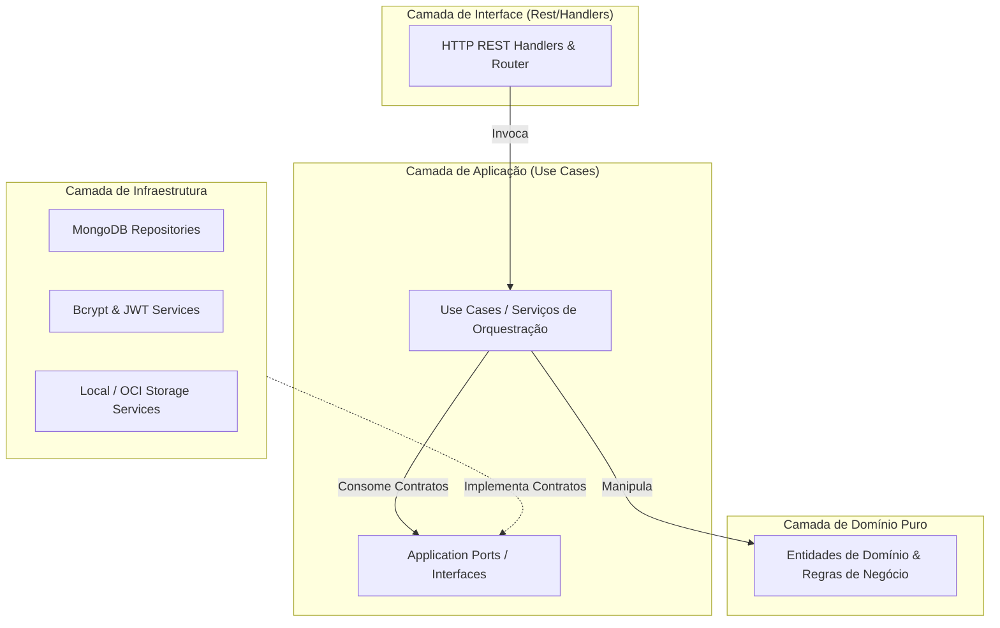

# 🏗️ Visão Geral da Arquitetura do Sistema — PS

O **PS (Photo Storage)** foi projetado como uma plataforma SaaS moderna e multi-tenant para gestão de ensaios fotográficos, eventos esportivos e clientes.

Este documento consolida os princípios de engenharia de software e padrões de design adotados no ecossistema, servindo como referência canônica.

Para navegação geral, retorne ao [Catálogo Canônico](../index.md).

---

## 🏛️ Filosofia Arquitetural

1. **Clean Architecture & DDD no Backend**: A lógica de domínio e as regras de negócio residem no centro do sistema, independentes de frameworks web, drivers de banco de dados ou detalhes de infraestrutura (conforme registrado no [ADR 0001](../adrs/0001-clean-architecture-go.md)).
2. **Segregação Rigorosa por Tenant**: Cada operação de leitura ou escrita opera estritamente no contexto de um `tenant_id` validado, prevenindo qualquer vazamento de dados entre empresas (detalhado em [Multi-tenancy e Isolamento de Dados](multitenancy-and-data.md)).
3. **Segurança em Profundidade**: Autenticação desacoplada baseada em cookies `HttpOnly`, CORS estrito, rate limiting e headers defensivos (detalhado em [Autenticação e Segurança](auth-and-security.md)).
4. **Desacoplamento SPA & API REST**: O frontend é uma Single Page Application (React 19) compilada como ativos estáticos, comunicando-se exclusivamente via endpoints REST JSON com a API Go.

---

## 📦 Estrutura de Camadas do Backend Go (`backend/`)

A organização das pastas sob `backend/internal/` segue estritamente a hierarquia da Clean Architecture:

### 1. Camada de Domínio (`backend/internal/domain/`)
- Contém structs puras e invariantes de negócio sem dependências de pacotes externos.
- Subdomínios:
  - [Tenant](../domain/tenant.md)
  - [Auth](../domain/auth.md)
  - [Client](../domain/client.md)
  - [Photographer](../domain/photographer.md)
  - [Season](../domain/season.md)
  - [Person](../domain/person.md)
  - [Report](../domain/report.md)
  - [AuditLog](../domain/auditlog.md)
- Todas as propriedades expostas em payloads de API utilizam tags `json:"camelCase"`.

### 2. Camada de Aplicação (`backend/internal/application/`)
- **`ports/`**: Define os contratos de repositórios (ex: `ClientRepository`, `TenantRepository`), serviços criptográficos e provedores de storage.
- **`usecase/`**: Implementa a lógica de caso de uso (ex: `RegisterUser`, `CreateClient`, `GenerateReportCSV`). Orquestra a persistência através das interfaces sem conhecer implementações concretas.

### 3. Camada de Infraestrutura (`backend/internal/infrastructure/`)
- Implementa os contratos definidos em `application/ports/`.
- Conexão com MongoDB (`mongo-driver`), geração de tokens JWT e hashing bcrypt (`infrastructure/auth/`), sanitização de arquivos em disco e integração com OCI ([Storage e Mídia](storage-and-media.md)).

### 4. Camada de Interfaces REST (`backend/internal/interfaces/rest/`)
- **`handlers/`**: Receptores HTTP que validam DTOs de entrada, invocam use cases e formatam respostas JSON usando os envelopes padronizados `httpx.Success`, `httpx.Created` e `httpx.Error`.
- **`router.go`**: Montagem das rotas `/api/v1/...`, registro de middlewares de segurança (CORS, RateLimiting, BodyLimit) e documentação Swagger condicional.

---

## 🖥️ Arquitetura do Frontend React (`frontend/`)

O frontend é construído sobre Vite + React 19 + TypeScript com componentes do Material UI v6:

- **Arquitetura Baseada em Features**: O código em `frontend/src/features/` é segregado por domínio de tela (`auth`, `dashboard`, `clients`, `photographers`, `seasons`, `reports`, `people`, `admin`).
- **Estado Global Desacoplado**: Utilização de Zustand para estado de sessão e interface ([Gerenciamento de Estado](../frontend/state-management.md)).
- **Transporte Transparente de Credenciais**: O Axios é configurado com `withCredentials: true`, permitindo que os navegadores gerenciem cookies `HttpOnly` com proteção nativa contra roubo de tokens por XSS.
- **Roteamento Protegido**: Componente `ProtectedRoute` inspeciona o perfil de autenticação e papéis RBAC ([Roteamento e RBAC](../frontend/routing-and-rbac.md)).

---

## 🔗 Referências Cruzadas
- [Autenticação e Segurança](auth-and-security.md)
- [Multi-tenancy e Isolamento de Dados](multitenancy-and-data.md)
- [Armazenamento e Mídia](storage-and-media.md)
- [Ambiente e Configurações Operacionais](../operations/environment-and-config.md)
- [ADR 0001: Clean Architecture em Go](../adrs/0001-clean-architecture-go.md)
