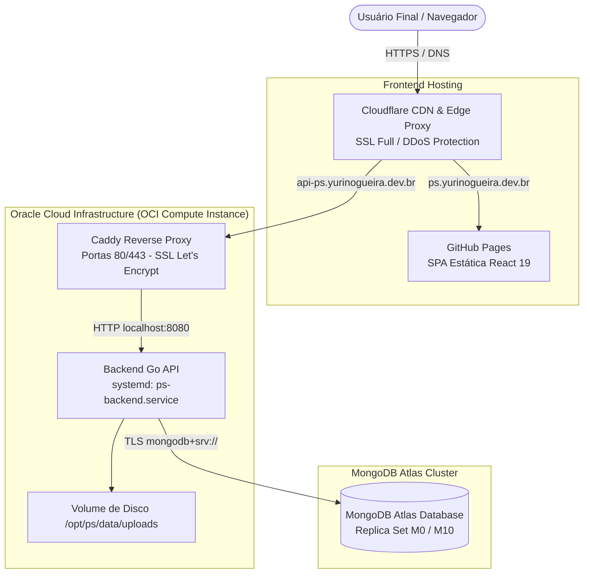

# ☁️ Deploy e Topologia de Nuvem — PS

A infraestrutura produtiva do **PS (Photo Storage)** é provisionada como código (IaC) via **Terraform** e hospedada na **Oracle Cloud Infrastructure (OCI)** com borda acelerada pela **Cloudflare**.

Para navegação geral, retorne ao [Catálogo Canônico](../index.md).

---

## 🏛️ Diagrama de Topologia de Produção



---

## 🏗️ Componentes Provisionados via Terraform (`terraform/`)

1. **OCI Compute & VCN (`compute.tf`, `network.tf`, `nsg.tf`)**:
   - Criação da Virtual Cloud Network (VCN), Subnet pública e Network Security Groups (NSG).
   - Instância Compute (Ubuntu 24.04 LTS) com IP reservado permanente.
   - Script de bootstrapping em nuvem via `cloud-init.sh` que provisiona Caddy, Go runtime e diretórios de serviço.
2. **DNS & Proteção Cloudflare (`cloudflare.tf`)**:
   - Registros tipo `A` apontando para o IP reservado da OCI.
   - Configuração de modo TLS estrito (*Full Strict*).
3. **MongoDB Atlas (`mongodb.tf`)**:
   - Provisionamento de cluster Atlas, usuários de banco com privilégios restritos e liberação de IP para a instância OCI.

---

## 🔄 Gerenciamento do Serviço Caddy e Backend

Na máquina virtual da OCI, o backend Go roda como daemon do sistema operacional:

```bash
# Verificar status do serviço da API:
sudo systemctl status ps-backend

# Reiniciar serviço da API após deploy:
sudo systemctl restart ps-backend

# Verificar logs do Caddy:
sudo journalctl -u caddy -n 50 --no-pager
```

---

## 🔗 Referências Cruzadas
- [Catálogo Canônico](../index.md)
- [Ambiente e Configurações](environment-and-config.md)
- [Pipelines de CI/CD](ci-cd-pipelines.md)
- [Runbook: Disaster Recovery](runbooks/disaster-recovery.md)
- [Runbook: Release e Rollback](runbooks/release-and-rollback.md)
