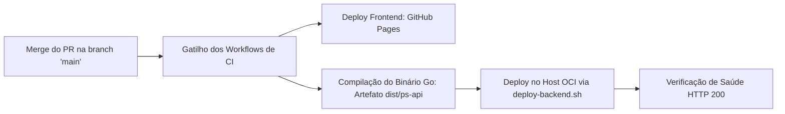

# 🚀 Runbook: Release e Rollback em Produção — PS

Este runbook padroniza a esteira de implantação (*release*) e as medidas de contingência para reversão imediata (*rollback*) no **PS (Photo Storage)**.

Para navegação geral, retorne ao [Catálogo Canônico](../../index.md).

---

## 📦 1. Fluxo Padrão de Release

O processo de entrega segue o protocolo de automação contínua via GitHub Actions:



### Validações Pós-Deploy:
1. **Frontend**: Acessar `https://ps.yurinogueira.dev.br` e confirmar versão dos assets no console.
2. **API Health Check**:
   ```bash
   curl -i https://api-ps.yurinogueira.dev.br/api/v1/health
   # Resposta esperada: HTTP/2 200 OK
   ```

---

## ⏪ 2. Procedimento de Rollback Imediato

Se uma nova versão introduzir regressões críticas de produção:

### 1. Rollback do Frontend (GitHub Pages)
1. No repositório GitHub, navegue até a aba **Actions** -> **Frontend**.
2. Localize a execução anterior bem-sucedida da branch `main`.
3. Dispare o re-deploy do artefato estático anterior ou reverta o commit na `main` via `git revert HEAD` seguido de push.

### 2. Rollback do Backend (API Go na OCI)
O script de deploy mantém o binário anterior como backup (`/opt/ps/bin/ps-api.old`):
```bash
ssh -i ~/.ssh/id_rsa ubuntu@<IP_RESERVADO>

# Restaurar versão anterior do binário:
sudo cp /opt/ps/bin/ps-api.old /opt/ps/bin/ps-api

# Reiniciar serviço da API:
sudo systemctl restart ps-backend

# Confirmar restabelecimento:
sudo systemctl status ps-backend
```

---

## 🔗 Referências Cruzadas
- [Catálogo Canônico](../../index.md)
- [Deploy e Topologia de Nuvem](../deploy-and-infrastructure.md)
- [Pipelines de CI/CD](../ci-cd-pipelines.md)
- [Runbook: Disaster Recovery](disaster-recovery.md)
